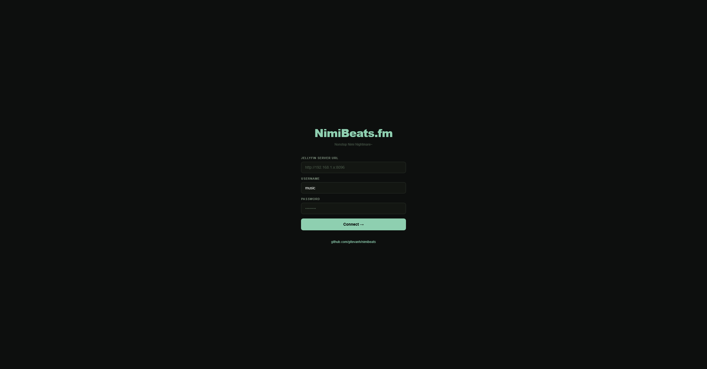
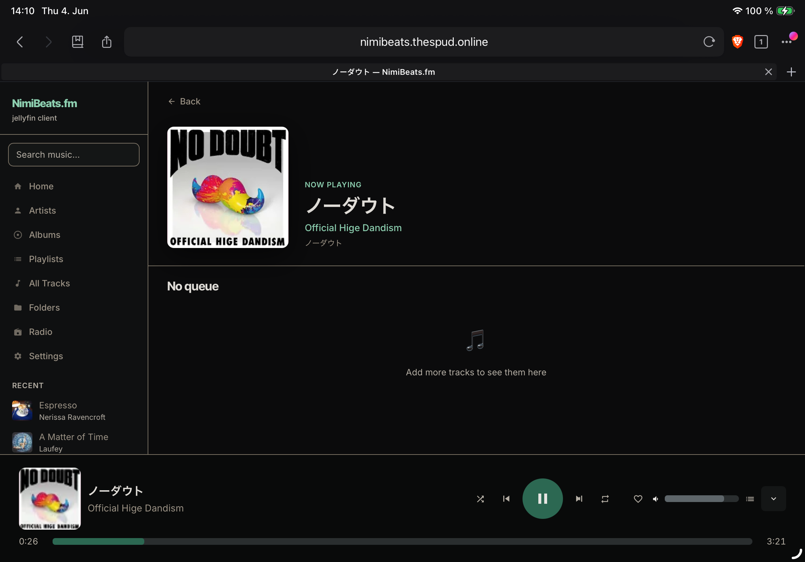
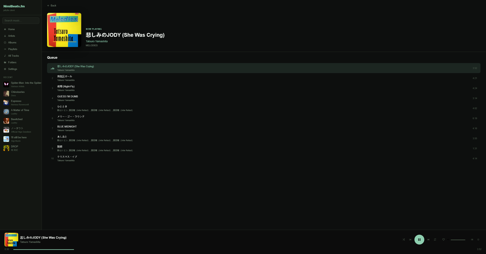
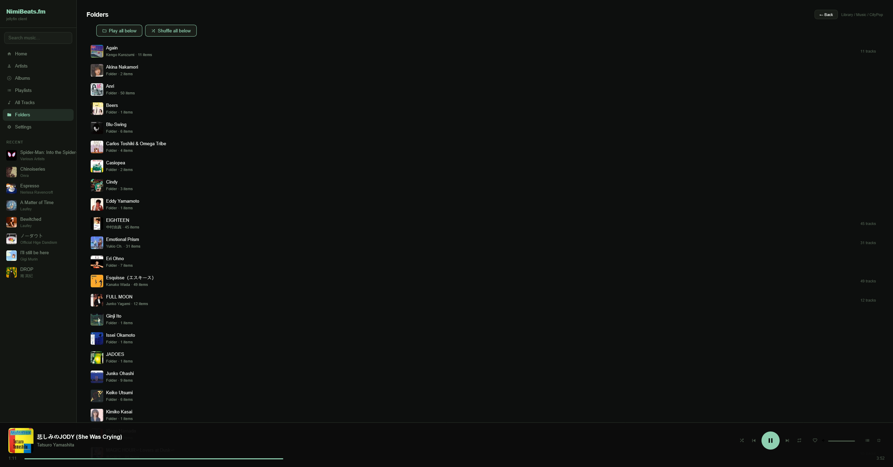
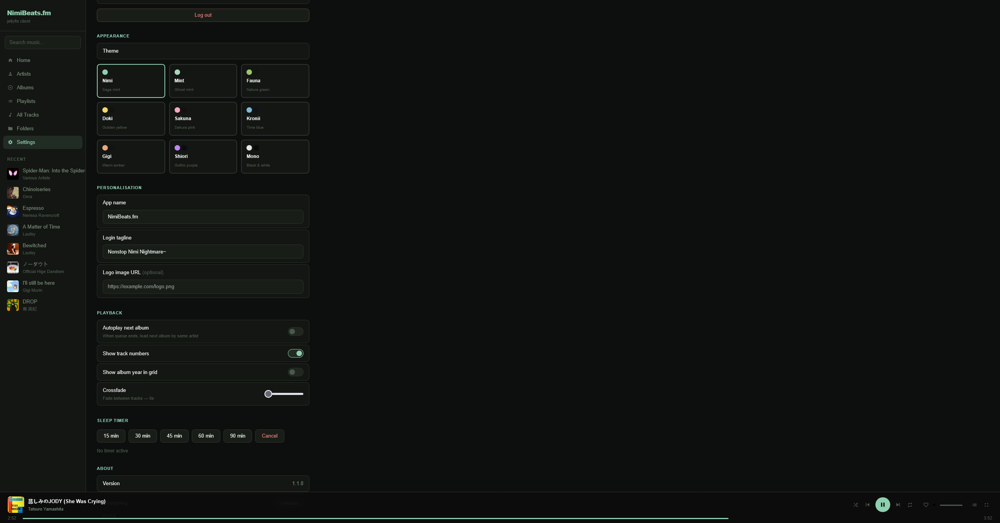
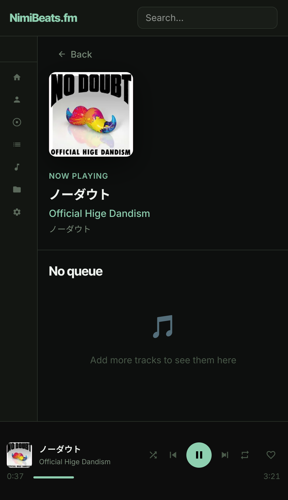

<div align="center">

# NimiBeats.fm

**A self-hosted Progressive Web App music client for [Jellyfin](https://jellyfin.org/)**

Designed for always-on tablet/kiosk use. Works great on iPad, Android, and desktop.
Single HTML file · No build tools · No frameworks · No dependencies beyond Jellyfin.

[](LICENSE)


<!-- ============================================================
     SCREENSHOT: Full app on desktop — home screen with album grid,
     sidebar visible, player bar at bottom. ~1400×900.
     screenshots/desktop-home.png
     ============================================================ -->


</div>

---

## What is this?

NimiBeats.fm is a music player web app that connects to your self-hosted Jellyfin media server. It was built as a dedicated kitchen/kiosk music player for an always-on iPad, but works equally well on any device. The entire app is a single `index.html` file with zero dependencies — no npm, no build step, no backend. Just drop it on any web server and open it.

---

## Screenshots

<!-- ============================================================
     SCREENSHOT: Login screen — logo, tagline, server/login form.
     screenshots/login.png
     ============================================================ -->
### Login


---

<!-- ============================================================
     SCREENSHOT: Home screen on iPad (horizontal) — favourites
     section, playlists row, recent albums grid.
     screenshots/ipad-home.png
     ============================================================ -->
### iPad Home Screen


---

<!-- ============================================================
     SCREENSHOT: Album tracklist — art, Play All/Shuffle/Radio
     buttons, tracks with one highlighted in green.
     screenshots/tracklist.png
     ============================================================ -->
### Tracklist View


---

<!-- ============================================================
     SCREENSHOT: Folder view — subfolders visible with
     "Play all below / Shuffle all below" buttons.
     screenshots/folders.png
     ============================================================ -->
### Folder View


---

<!-- ============================================================
     SCREENSHOT: Settings page — theme picker cards visible.
     screenshots/settings.png
     ============================================================ -->
### Settings & Themes


---

<!-- ============================================================
     SCREENSHOT: Mobile (Android/phone) — two-row player bar
     at the bottom with a track playing.
     screenshots/mobile.png
     ============================================================ -->
### Mobile Layout


---

## Features

### Playback
- Full audio streaming via the Jellyfin API
- Play/pause, previous/next, seek, volume
- Shuffle and repeat modes (off / all / one)
- **Crossfade** — smooth fade between tracks, 0–12 seconds configurable
- **Queue management** — add, reorder, remove, clear
- **Queue persistence** — survives page reloads via localStorage
- **Hardware media key support** — keyboard media keys, Bluetooth headphones, iOS/Android lock screen controls via [Media Session API](https://developer.mozilla.org/en-US/docs/Web/API/Media_Session_API)

### Library
- Browse by **Albums**, **Artists**, **All Tracks**, or **Folders**
- **Unlimited library size** — auto-paginated (500 items/request), loads everything
- **All Tracks view** — sortable (A–Z, artist, album, recent) with inline filter bar
- **Folder view** — mirrors your actual file structure on disk, with recursive Play/Shuffle for entire folder trees
- Recently added albums on home screen

### Search
- Jellyfin full-text search across albums, artists, and tracks
- **Local fuzzy artist matching** — finds artists by romanized name, native script, or partial match. Searching `tatsuro` finds `Tatsuro Yamashita`; `山下達郎` also works

### Artist Tools
- **Artist Radio** — one button shuffles every track across all of an artist's albums
- **Artist merge** — detects and deduplicates artists split across multiple scripts or romanizations. Merge map persists across sessions

### Playlists & Favourites
- Browse, play, and delete Jellyfin playlists
- Create playlists on the fly from any track via right-click / long-press context menu
- **Favourites** — heart any track from the player bar or context menu, shown on home screen
- **Sleep timer** — 15 / 30 / 45 / 60 / 90 min presets, countdown in the player bar

### Themes
Nine built-in colour themes:

| Theme | Accent | Inspired by |
|-------|--------|------------|
| **Nimi** | Sage mint | Nimi Nightmare — default |
| **Mint** | Ghost mint | Mint Fantôme |
| **Fauna** | Nature green | Ceres Fauna |
| **Doki** | Golden yellow | Dokibird |
| **Sakuna** | Sakura pink | Sakuna |
| **Kronii** | Time blue | Ouro Kronii |
| **Gigi** | Warm amber | Gigi |
| **Shiori** | Gothic purple | Shiori Novella |
| **Mono** | Black & white | — |

### Personalisation
- Custom app name, login tagline, and logo URL (all live-previewed)
- Settings persist across sessions via localStorage

### PWA
- Installable as a home screen app on iOS, iPadOS, and Android
- **Offline app shell** via Service Worker — loads even on flaky LAN
- iPad safe area support for home indicator
- Swipe left/right to skip tracks; swipe up on player bar to open Now Playing
- Expandable player bar on desktop for larger screens

---

## How it works

NimiBeats is a static frontend that talks directly to your Jellyfin server's REST API. The only server-side requirement is that your Jellyfin instance is reachable from the browser and has CORS configured to allow requests from wherever NimiBeats is hosted.

```
Browser
   │
   │  Fetches index.html (any static host)
   │
   ├──► Jellyfin API  (auth, library, streaming)
   │
   └──► Google Fonts  (Inter typeface, optional)
```

---

## Deployment

### Requirements
- A running [Jellyfin](https://jellyfin.org/) instance reachable from your browser
- Any web server to serve the static files (Nginx, Apache, Caddy, Python's `http.server`, a NAS, Cloudflare Pages — anything works)
- CORS configured so your browser can reach Jellyfin from NimiBeats' origin

### 1. Serve the files

Copy `index.html`, `manifest.json`, `sw.js`, `icon-192.png`, and `icon-512.png` to any web server's root.

**Examples:**

```bash
# Python (quick local test)
python3 -m http.server 8080

# Nginx — drop files in your web root
cp index.html manifest.json sw.js icon-*.png /var/www/html/

# Docker
docker run -p 8080:80 -v $(pwd):/usr/share/nginx/html nginx
```

### 2. Configure CORS on Jellyfin

NimiBeats makes API requests from the browser directly to Jellyfin. For this to work, Jellyfin needs to allow cross-origin requests from wherever NimiBeats is hosted.

**Option A — Jellyfin Dashboard (newer versions):**
> Dashboard → Networking → CORS Hosts → add your NimiBeats URL (e.g. `https://nimibeats.yourdomain.com`)

**Option B — Reverse proxy CORS headers:**
If you're putting a reverse proxy (Nginx, Caddy, Traefik, etc.) in front of Jellyfin, you can inject the CORS headers there instead. Example Nginx snippet:

```nginx
# Add to your Jellyfin proxy_pass location block
add_header 'Access-Control-Allow-Origin' '$http_origin' always;
add_header 'Access-Control-Allow-Methods' 'GET, POST, OPTIONS, DELETE' always;
add_header 'Access-Control-Allow-Headers' 'Authorization, Content-Type, X-Emby-Authorization, X-Emby-Token' always;

if ($request_method = 'OPTIONS') {
    add_header 'Access-Control-Allow-Origin' '$http_origin';
    add_header 'Access-Control-Allow-Methods' 'GET, POST, OPTIONS, DELETE';
    add_header 'Access-Control-Allow-Headers' 'Authorization, Content-Type, X-Emby-Authorization, X-Emby-Token';
    return 204;
}
```

### 3. HTTPS

If NimiBeats is served over HTTPS, Jellyfin must also be reachable over HTTPS — browsers block mixed HTTP/HTTPS requests. [Let's Encrypt](https://letsencrypt.org/) is free and works with any reverse proxy.

### 4. Open and connect

Navigate to your NimiBeats URL and enter your Jellyfin server address and credentials. That's it — settings are saved in localStorage so you only do this once.

**Bookmarkable URL parameters:**
```
?server=https://jellyfin.yourdomain.com   pre-fills the server URL
?user=admin                                pre-fills the username
?view=nowplaying                           jumps to Now Playing after login
```

---

## Install as a Home Screen App

**iOS / iPadOS (Safari):**
1. Open the URL in Safari
2. Share → **Add to Home Screen**
3. Launches fullscreen with no browser chrome

**Android (Chrome):**
1. Open the URL in Chrome
2. Menu → **Install App** or **Add to Home Screen**

---

## Keyboard Shortcuts

| Key | Action |
|-----|--------|
| `Space` | Play / Pause |
| `→` | Next track |
| `←` | Previous track |
| `Q` | Toggle queue panel |
| Media keys | Play/Pause/Next/Prev via Media Session API |

**Touch gestures:**

| Gesture | Action |
|---------|--------|
| Swipe left on player | Next track |
| Swipe right on player | Previous track |
| Swipe up on player | Open Now Playing view |
| Long press on track | Context menu (queue, playlist, favourites) |

---

## Inspired by

[Nimi Nightmare](https://www.youtube.com/@NimiNightmare) — independent VTuber, baku nurse, cozy dreamer, and the entire reason this project exists.

---

## License

MIT — do whatever you want with it.
